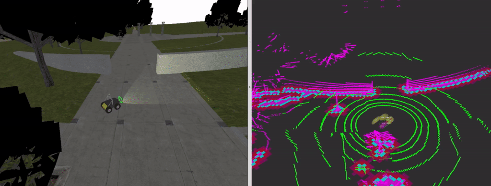
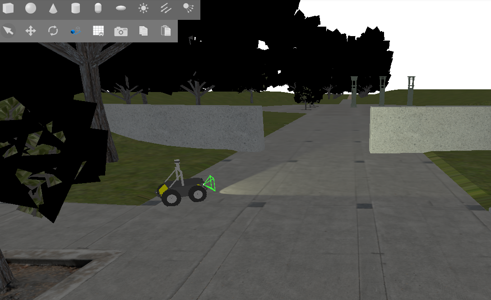
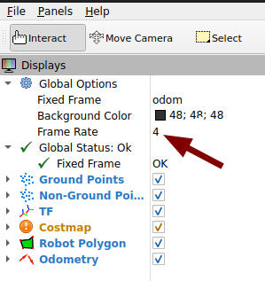

# NAV2 Ground Consistency Demo

A tutorial demonstrating terrain-aware navigation using 3D lidar ground segmentation with Nav2's [ground consistency costmap layer](https://github.com/dfki-ric/nav2_ground_consistency_costmap_plugin). Learn how to classify terrain into traversable ground and obstacles, then use that classification to build smarter costmaps for safer navigation.



## Overview

This tutorial demonstrates a complete workflow for terrain-aware navigation:

1. **Gazebo Simulation** - A Husky robot with VLP-16 lidar in realistic terrain
2. **Ground Segmentation** - Classifies every lidar point as ground or obstacle
3. **Height-Based Filtering** - Distinguishes actual blocking obstacles from overhead structures
4. **Nav2 Integration** - Uses segmentation to build cost maps that understand terrain
5. **Smart Navigation** - Robot avoids real obstacles while safely navigating complex terrain

## Requirements

It is assumed you have ROS 2 Jazzy installed. To install all required dependencies and clone necessary repositories, run:

```bash
   cd ~/path_to_my_custom_workspace
   mkdir -p src && cd src
   git clone https://github.com/ros-navigation/navigation2_tutorials.git && cd navigation2_tutorials
   git checkout -t remotes/origin/jazzy
```
```bash
   cd nav2_ground_consistency_demo
   bash install_dependencies.bash ~/path_to_my_custom_workspace
```

This script will:

- Install required ROS 2 packages (Gazebo, visualization, navigation)
- Clone all necessary repositories (KISS-ICP, ground segmentation, etc.)
- Provide next steps for building

## Ground Segmentation Overview

**What is Ground Segmentation?**

Ground segmentation is the first step in terrain-aware navigation. It takes raw 3D lidar point cloud data and classifies every point into two categories:

- **Ground Points**: Points that lie on the terrain surface (traversable)
- **Non-Ground Points**: Points above the terrain surface (potential obstacles)

This is done by analyzing the geometry of the point cloud - points that are approximately at the same height and form a plane are ground, while points sticking up above this plane are classified as obstacles. The algorithm doesn't require a pre-built map; it works in real-time as the robot moves.

**Why is this important?** Without ground segmentation, a navigation system can't tell the difference between actual obstacles and normal terrain variations (like slopes or small rocks). Ground consistency uses this classification to make smarter navigation decisions.

## Ground Consistency Overview

### What is Ground Consistency?

Traditional occupancy grids treat all obstacles equally. A 10cm tall rock and a 2m tall wall both show up as "occupied." This causes problems:

- **On slopes**: Real traversable ground is marked as obstacles
- **Under structures**: Bridges and overpasses block navigation unnecessarily  
- **In clutter**: Small harmless debris at ground level makes navigation overly cautious

**Ground consistency** solves this by adding a height dimension to costmaps. It answers: *"Is this obstacle actually blocking my robot, or is it something I can navigate over/under?"*

### How It Works

The ground consistency layer works in three main phases:

**Phase 1: Collect Evidence**
- Each grid cell remembers two types of evidence:
  - How much ground evidence it has seen (from ground points)
  - How much obstacle evidence it has seen (from obstacle points)
- Every time new lidar data arrives, the cell's evidence scores go up
- Obstacle evidence is weighted slightly heavier than ground evidence (obstacles are harder to dismiss)
- This creates a confidence score: how likely is this cell actually an obstacle?

**Phase 2: Check If It's Really Blocking**
Before marking something as "don't go here", the layer asks:
1. Is there really an obstacle here? (check confidence score)
2. How high is it compared to the actual ground?
3. Is the robot tall enough to pass under it?

To find the ground level:
- First, look at actual ground points in the same cell
- If none exist, check nearby cells and average their ground heights (neighborhood voting - disabled by default, can be enabled via `ground_neighbor_search_cells` parameter)
- If still nothing, assume it's dangerous and mark it as "don't go"

Then compare heights:
- If the obstacle is taller than the robot → it's just overhead → mark as **safe to cross**
- If the obstacle is very small → ignore it → mark as **safe to cross**
- If the obstacle is at robot height → it blocks the robot → mark as **don't go**

**Phase 3: Forget Old Observations**
Each update cycle, old evidence fades:
- Ground evidence fades faster (false ground classifications get forgotten quickly)
- Obstacle evidence fades slower (real obstacles stay in memory longer)
- This makes navigation smooth: sensor noise doesn't confuse the map, but real obstacles remain known

**Result: Smart Navigation Map**
- Cells marked as **safe**: Empty (not visible in costmap, the robot can freely navigate through)
- Cells marked as **danger** (magenta): Real blocking obstacles at robot height (lethal)
- Cells slowly changing colors: Evidence is fading and the cell's classification is transitioning (you can watch the map update in real-time as old observations are forgotten)

## Tutorial Steps

### Step 0: Verify Installation

Test that everything is installed correctly:

```bash
# Check ROS 2 packages
cd ~/my_custom_workspace && source install/setup.bash
ros2 pkg list | grep -E "ground_segmentation|kiss_icp|nav2_ground_consistency"
```

You should see:
- `ground_segmentation_ros2`
- `kiss_icp`
- `nav2_ground_consistency_costmap_plugin`
- `nav2_ground_consistency_demo`

### Step 1: Launch Gazebo Simulation

In **Terminal 1**, start the Gazebo simulation with the Husky robot:

Note: Gazebo will take some time to download the baylands terrain and husky model
```bash
source install/setup.bash
ros2 launch nav2_ground_consistency_demo start.launch.py
```

You should see:
- Gazebo opens with Baylands terrain
- Husky robot appears on the ground
- ROS topics `/husky/scan/points`, `/husky/imu` being published



Verify the lidar is working:

```bash
ros2 topic hz /husky/scan/points
```

You should see ~5-10 Hz updates based on your computer specifications. You will need to set your rviz 'Frame Rate' to this value to avoid issues with rviz visualizations.



### Step 2: Launch Navigation Stack

In **Terminal 2**, launch the stack with the ground consistency layer (this includes ground segmentation):

On some systems, the `ground_segmentation_ros2_node` may fail to start with: `error while loading shared libraries: libjawt.so: cannot open shared object file`

Fix this error by using the following:

```bash
export JAVA_HOME=$(dirname $(dirname $(readlink -f $(which javac))))
echo "$JAVA_HOME/lib" | sudo tee /etc/ld.so.conf.d/java.conf
echo "$JAVA_HOME/lib/server" | sudo tee -a /etc/ld.so.conf.d/java.conf
sudo ldconfig
```

```bash
source install/setup.bash
ros2 launch nav2_ground_consistency_demo full_stack.launch.py
```

```bash
ros2 lifecycle set /controller_server configure
ros2 lifecycle set /controller_server activate
```


This starts:
- **Ground Segmentation** - Classifies lidar points in real-time
- **KISS-ICP Odometry** - Estimates robot pose from lidar
- **Controller Server** - Path tracking and obstacle avoidance
- **RViz2** - Visualization (auto-starts)
- **Lifecycle Transitions** - Automatic state management

You should see RViz open with:
- Robot footprint (yellow rectangle)
- Lidar pointcloud (cyan points)
- Local costmap
- Ground consistency layer visualization

**Verify that everything is working** in **Terminal 3**:

```bash
# Check KISS-ICP odometry
ros2 topic hz /tf

# Check ground segmentation output
ros2 topic hz /ground_segmentation/ground_points
ros2 topic hz /ground_segmentation/obstacle_points
```

You should see:
- `/tf` publishing at ~5-10 Hz (odometry transforms)
- Ground points publishing at ~5-10 Hz (from ground segmentation)
- Obstacle points publishing at ~5-10 Hz (from ground segmentation)

If any topic shows "0 Hz", something is not working - check the logs in the launch terminal for errors.

### Step 3: Move the Robot

To move the robot around and see ground consistency in action:

In **Gazebo**:
1. Click the menu (⋮) in the top-right corner
2. Search for "Teleop" and select the teleop widget
3. Change the topic field to `/model/husky/cmd_vel`
4. Use the sliders or buttons to move the robot forward/backward and rotate

Watch the costmap in RViz update in real-time as the robot moves:
- **On flat ground**: Costmap shows mostly empty (safe)
- **On slopes**: Ground segmentation classifies the slope as traversable (not blocked)
- **Over small obstacles**: Debris below robot height doesn't appear as lethal obstacles
- **Under overpasses**: If your world has them, the robot can navigate underneath

Key observations:
- Magenta cells (lethal) appear only for real blocking obstacles at robot height
- As the robot moves away from an area, the evidence fades and the magenta cells gradually disappear
- Watch the costmap dynamically update as sensor data flows in

## Conclusion

You now understand:

1. ✅ **Ground Segmentation**: How lidar points are classified as ground or obstacles
2. ✅ **Height Filtering**: How the costmap distinguishes navigable vs blocking obstacles
3. ✅ **Evidence Accumulation**: How temporal decay makes navigation robust and reactive
4. ✅ **Nav2 Integration**: How ground consistency layers improve costmap quality
5. ✅ **Real-World Application**: How to tune parameters for your terrain and robot

## Extended Topics

### Debugging

**No lidar points visible in RViz:**
```bash
ros2 topic echo /husky/scan/points
```

**Ground segmentation very slow:**
- Enable downsampling in `parameters.yaml`
- Reduce lidar resolution in simulation config

**No ground points detected:**
- Check `lidar_to_ground` parameter in `config/gseg3d_config.yaml`
- This should match your lidar's height above the ground (negative value)
- If incorrect, all points will be classified as obstacles
- Verify with: `ros2 topic echo /ground_segmentation/ground_points`

**Robot doesn't avoid obstacles:**
- Check that full_stack.launch.py is running and ground segmentation is publishing
- Verify costmap is receiving points: `ros2 topic hz /ground_segmentation/obstacle_points`
- Check Nav2 logs for errors

### Hardware Adaptation

The demo is tuned for a Husky with VLP-16 lidar. To adapt to your robot:

1. **Update robot model** in `simulation/models/COSTAR_HUSKY_SENSOR_CONFIG_1/model.sdf`
2. **Update lidar and IMU static transforms** in `simulation/start.launch.py` static transform
3. **Update robot dimensions** in `config/nav2_config.yaml` (robot_height, etc.)
4. **Retune ground segmentation** parameters in `config/gseg3d_config.yaml` for your lidar's FOV and point density

## References

- [NAV2 Documentation](https://docs.nav2.org/)
- [Ground Consistency Layer Plugin](https://github.com/dfki-ric/nav2_ground_consistency_costmap_plugin)
- [Ground Segmentation ROS2](https://github.com/dfki-ric/ground_segmentation_ros2)
- [KISS-ICP Odometry](https://github.com/prbonn/kiss-icp)
- [Gazebo Simulator](https://gazebosim.org/)
- [Clearpath Husky Robot](https://clearpathrobotics.com/husky)
- [ROS 2 Jazzy Documentation](https://docs.ros.org/en/jazzy/)

### Husky Robot Model

This demo uses a local copy of the COSTAR_HUSKY_SENSOR_CONFIG_1 model from Gazebo Fuel. The local copy has been modified to enable IMU orientation output (`enable_orientation=1`) for proper quaternion-based orientation estimates, which is required for ground segmentation with IMU integration. A DiffDrive plugin was included in the robot model which executes motion commands sent to the robot.

**Original Model Citation:**
```bibtex
@online{GazeboFuel-OpenRobotics-COSTAR_HUSKY_SENSOR_CONFIG_1,
	title={COSTAR_HUSKY_SENSOR_CONFIG_1},
	organization={Open Robotics},
	date={2023},
	month={September},
	day={3},
	author={OpenRobotics},
	url={https://fuel.gazebosim.org/1.0/OpenRobotics/models/COSTAR_HUSKY_SENSOR_CONFIG_1},
}
```

### Funding

Developed at the Robotics Innovation Center (DFKI), Bremen. Supported by Robdekon2 (50RA1406), German Federal Ministry for Research and Technology.


